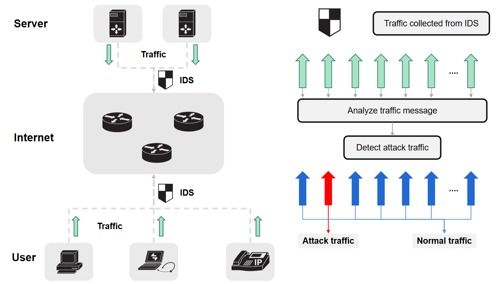
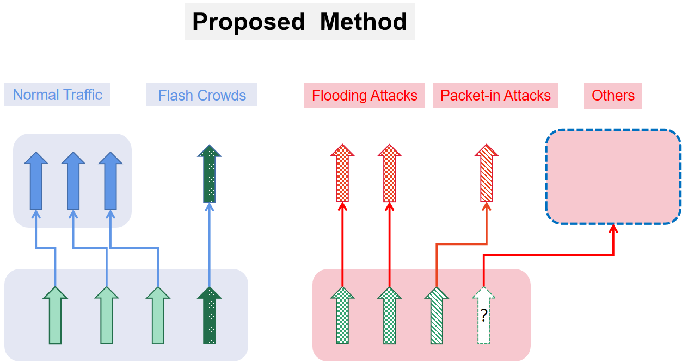
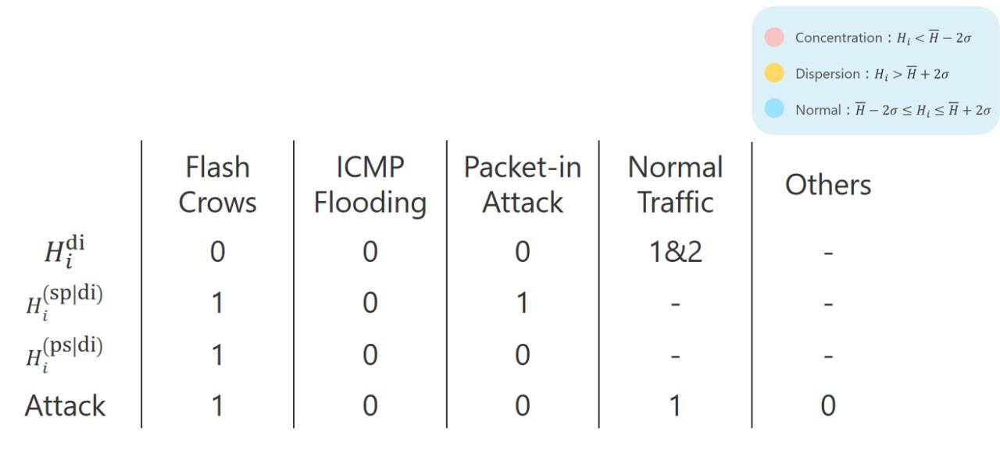
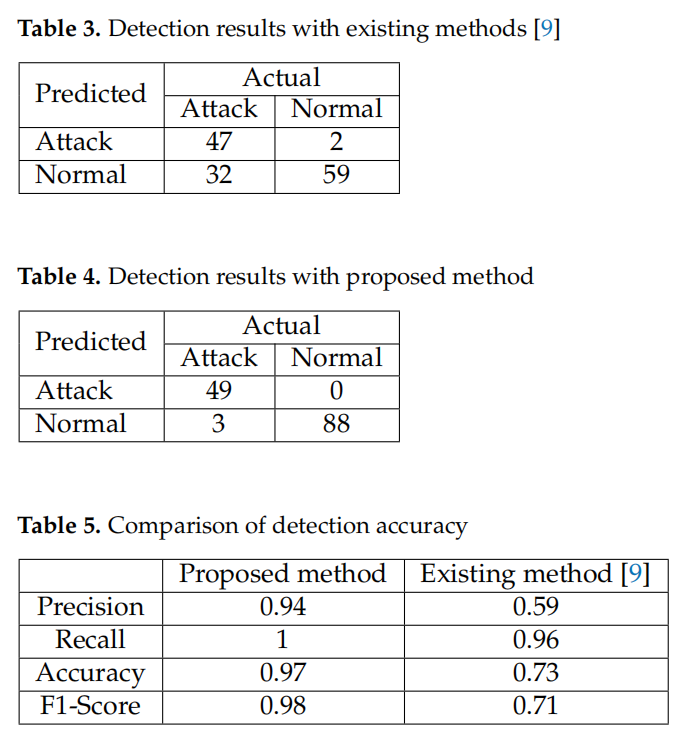

# A DDoS attack detection method using conditional entropy based on SDN traffic

## Introduction

We propose an attack detection method using conditional entropy based on the anomaly-based entropy method for IDS, which takes into account the changes in the network structure due to SDN and multiple traffic factors such as flash crowds.

How this algorithm determines the attack can be known according to the following figure

## Main-algorithm

Using plot_Joint-entropy.ipynb, it is possible to calculate 3 types of entropy for each time period for the input of the data set, and achieve the detection of attacks according to the pre-set determination criteria.

- Old Attack Method 1
- Old Attack Method 2
- TQV Attack Method 1
- TQV Attack Method 2
- TQV Attack Method 3 ← the technique proposed in this article

The pre-set determination criteria is based on the above figure

## Result

- Old Attack Method 2  ← existing method
- TQV Attack Method 3 ← proposed method
